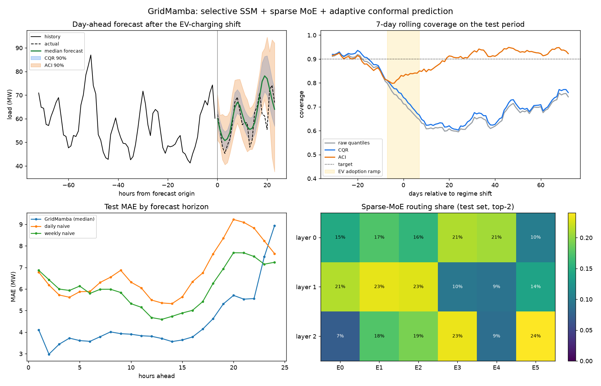

# GridMamba

Probabilistic day-ahead electricity-load forecasting built from recent sequence-modeling and uncertainty-quantification techniques, all in plain PyTorch:

| Component | Technique | File |
|---|---|---|
| Token mixing | Mamba-style **selective state-space model**: input-dependent Δ, B, C; ZOH discretization; S4D-real init | [`ssm.py`](src/gridmamba/ssm.py) |
| Scan | **Parallel associative scan** (Hillis–Steele, O(log L) depth), tested against a sequential reference | [`ssm.py`](src/gridmamba/ssm.py) |
| Channel mixing | **Sparse Mixture-of-Experts**, top-2 routing over SwiGLU experts, Switch load-balancing loss, ST-MoE router z-loss | [`moe.py`](src/gridmamba/moe.py) |
| Input | **PatchTST-style patching** plus **RevIN** instance normalization, for scale-equivariant forecasts | [`model.py`](src/gridmamba/model.py) |
| Output | **Non-crossing quantile head** (median plus cumulative-softplus offsets), trained with pinball loss | [`model.py`](src/gridmamba/model.py) |
| Calibration | **Conformalized Quantile Regression**, with finite-sample guarantee under exchangeability | [`conformal.py`](src/gridmamba/conformal.py) |
| Drift | **Adaptive Conformal Inference**, online miscoverage control under distribution shift | [`conformal.py`](src/gridmamba/conformal.py) |

## The task

Eight synthetic regions of hourly load over two years ([`data.py`](src/gridmamba/data.py)). Load is driven by daily and weekly profiles, a U-shaped temperature response, trend, and heteroscedastic AR(1) noise. Each forecast issued at midnight predicts the next 24 hours from the past 168 hours.

Near the end of the timeline, **EV-charging adoption** ramps in. It adds a late-night peak and roughly doubles volatility. The model never sees this in training or calibration, so the test period has a real distribution shift.

```
|------ train 60% ------|- val 10% -|--- calibration 15% ---|------ test 15% ------|
                                                                   ^ EV shift
```

## Quick start

```bash
uv sync
uv run pytest
uv run gridmamba --epochs 20
```

A run takes about 3 minutes on an Apple-silicon GPU (`--device auto` picks CUDA, then MPS, then CPU). It writes `outputs/metrics.json`, `outputs/report.png` and a checkpoint.

## Results

Test set: 880 day-ahead forecasts (8 regions × 110 days), 90% target coverage. Numbers are from `uv run gridmamba --epochs 20 --seed 0`.

**Point accuracy**

| Model | MAE | RMSE |
|---|---|---|
| **GridMamba (median)** | **4.45** | **6.54** |
| Weekly naive | 6.05 | 8.99 |
| Daily naive | 6.75 | 9.44 |

**90% intervals**: coverage / mean width / interval score (lower is better)

| Method | Pre-shift | Post-shift | Whole test |
|---|---|---|---|
| Raw model quantiles | 90.4% / 8.6 / 11.7 | 66.8% / 15.3 / 41.1 | 72.6% / 12.2 / 30.8 |
| CQR | 91.5% / 9.1 / 11.8 | 68.2% / 15.8 / 40.3 | 74.0% / 12.7 / 30.2 |
| **ACI** | **89.9%** / 8.6 / 11.7 | **92.5%** / 27.1 / **32.4** | **89.7%** / 19.4 / **24.7** |
| Weekly naive + split conformal | 94.7% / 22.2 / 26.2 | 70.5% / 22.2 / 70.7 | 80.0% / 22.2 / 51.7 |



### What the results show

- **Before the shift, CQR does its job.** Coverage sits at the target, with intervals less than half as wide as a conformalized naive baseline.
- **After the shift, every static method breaks.** CQR's guarantee assumes exchangeability, and coverage falls to about 68%.
- **ACI recovers the target within a few weeks.** It raises the effective quantile level and learns from a rolling window of recent scores. Wider intervals are the honest price of a model that has not seen the new regime.
- **The 23–24 h horizons are the model's weak spot after the shift.** That is exactly when the unseen EV peak lands. Retraining on post-shift data is the real fix, and ACI keeps the intervals trustworthy until then.
- **MoE routing stays balanced.** The load-balancing term holds near its minimum of 1.0, and each layer develops its own specialization pattern (bottom-right panel).

## Project layout

```
src/gridmamba/
  data.py        synthetic multi-region load generator, splits, windowing
  ssm.py         selective scan (parallel + sequential) and MambaBlock
  moe.py         top-k sparse MoE with auxiliary losses
  model.py       RevIN -> patch embed -> [Mamba + MoE] x N -> quantile head
  conformal.py   split conformal, CQR, adaptive conformal inference
  metrics.py     pinball, MAE/RMSE, coverage, width, interval score
  baselines.py   daily / weekly seasonal naive
  train.py       AdamW + warmup/cosine, early stopping
  plots.py       report figure
  cli.py         end-to-end pipeline
tests/           scan equivalence, causality, RevIN equivariance, conformal coverage
```

## References

- Gu & Dao, *Mamba: Linear-Time Sequence Modeling with Selective State Spaces* (2023)
- Fedus, Zoph & Shazeer, *Switch Transformers* (2021); Zoph et al., *ST-MoE* (2022)
- Nie et al., *A Time Series is Worth 64 Words (PatchTST)* (2023)
- Kim et al., *Reversible Instance Normalization for Accurate Time-Series Forecasting* (2022)
- Romano, Patterson & Candès, *Conformalized Quantile Regression* (2019)
- Gibbs & Candès, *Adaptive Conformal Inference Under Distribution Shift* (2021)
